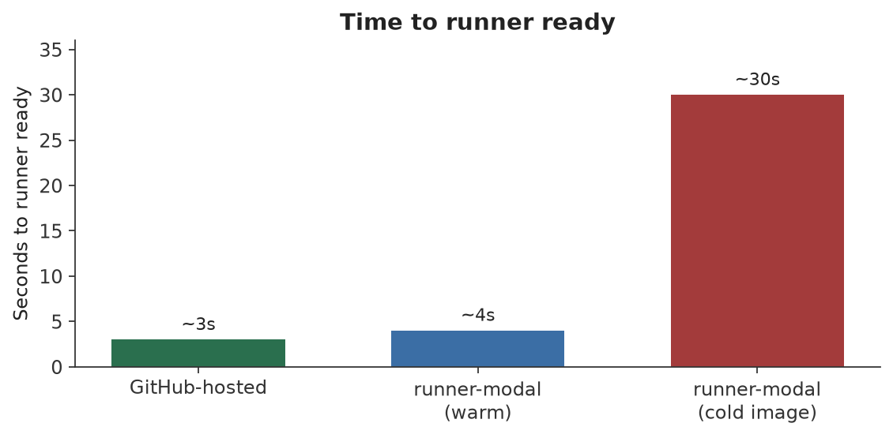
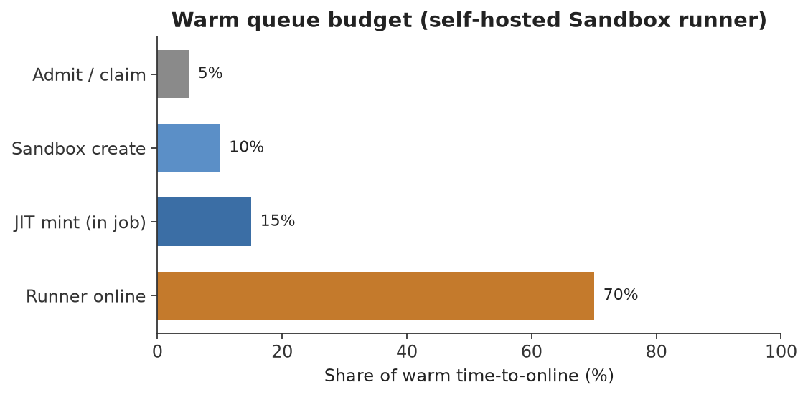
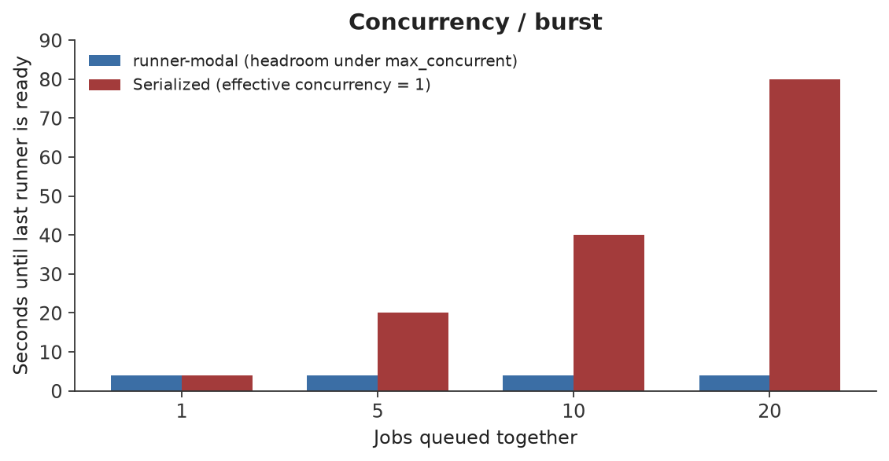
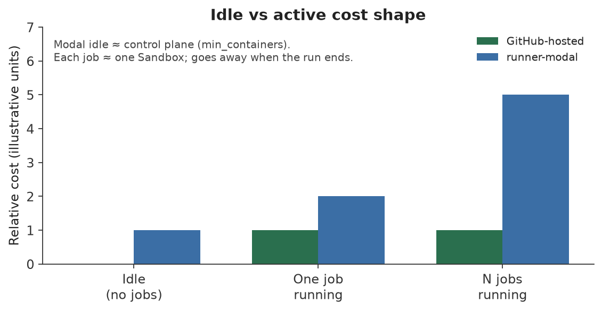

# runner-modal

Self-hosted [GitHub Actions](https://docs.github.com/en/actions) runners on [Modal](https://modal.com).

One public type — `Runner` — registers a webhook control plane. Jobs run as Modal Sandboxes (`python -m runner_modal.job`). The API mirrors Modal (`Runner` ≈ Volume + Server; `Runner.Job` ≈ Sandbox).

## Requirements

- Python >= 3.12
- A [Modal](https://modal.com) account and CLI
- A named Modal Secret with `GITHUB_TOKEN` and `WEBHOOK_SECRET`

## Installation

From this repo (deploy and `modal run` from the repo root):

```bash
uv sync
```

## Quick start

### 1. Create a Modal Secret

```bash
modal secret create github-runner \
  GITHUB_TOKEN=ghp_xxx \
  WEBHOOK_SECRET=$(openssl rand -hex 32)
```

| Key | Used by | Purpose |
|-----|---------|---------|
| `GITHUB_TOKEN` | Job Sandbox | Mint JIT inside the job |
| `WEBHOOK_SECRET` | Server | HMAC on `POST /github` |

Pass a **named** Secret (`modal.Secret.from_name`). No credential env fallbacks.

### 2. Deploy

```bash
modal deploy examples/github_webhook.py
```

```python
import modal
from runner_modal import Runner

app = modal.App("acme-ci")
gh = modal.Secret.from_name(
    "github-runner",
    required_keys=["GITHUB_TOKEN", "WEBHOOK_SECRET"],
)

runner = Runner.create(
    app=app,
    name="acme",
    secret=gh,
    compute_region="us-east",
    labels=["self-hosted", "modal", "acme"],
    max_concurrent=20,
    idle_timeout=900,
)
```

Call `Runner.create` once per App. It publishes the job Image `{name}-job` and persists `secret_name` / `job_image_name` so the Server can `Image.from_name` and reattach the Secret on each job.

### 3. Point GitHub at the webhook

```python
print(Runner.from_name("acme").url)  # None until ready
# Webhook: {url}/github
```

```yaml
runs-on:
  - self-hosted
  - modal
  - acme
  - job-${{ github.run_id }}-${{ github.job }}
```

Include every pool label plus a unique pin so one runner maps to one job.

## How it works

```text
GitHub  --workflow_job-->  GitHubServer
                              │
                       claim delivery ID
                              │
                       Job.create → Sandbox
                              │
                       python -m runner_modal.job
                              │
                       mint JIT → ./run.sh --jitconfig …
```

| Piece | Modal object | Role |
|-------|--------------|------|
| Meta | Dict `{name}-runner-meta` | Labels, capacity, secret/image names, defaults |
| Deliveries | Dict `{name}-runner-deliveries` | Claim before create |
| Job image | Named Image `{name}-job` | Published at `Runner.create` |
| Cache | Volume `{name}-cache` → `/cache` | Optional; not `actions/cache` |
| Control plane | Server `GitHubServer` | HMAC, admission, create/cancel |
| Job | Sandbox | `python -m runner_modal.job` |

Webhook: [`examples/github_webhook.py`](examples/github_webhook.py). Imperative: [`examples/imperative_create.py`](examples/imperative_create.py).

**Admission:** `self-hosted` on the job, non-empty pool labels, and `pool ⊆ job.labels`. Empty pool admits nothing.

**Secrets:** named only; Server uses `WEBHOOK_SECRET`, jobs get the same Secret for `GITHUB_TOKEN`. Never put tokens or JIT in Sandbox `env=` (`RUNNER_JOB_SPEC` carries non-secret inputs).

## Performance

What matters for runners is time-to-start, cold vs warm, concurrency, and idle cost — not workflow pytest time.









Charts are illustrative. Regenerate with `uv run --group dev python scripts/charts.py`.

`max_concurrent` is a soft list-then-create check (TOCTOU). Idle cost is mainly `min_containers`; each job is an ephemeral Sandbox.

## Imperative jobs

```python
gh = modal.Secret.from_name("github-runner", required_keys=["GITHUB_TOKEN"])

job = Runner.Job.create(
    runner,
    repository="acme/api",
    labels=["modal", "acme", "job-1"],
    secret=gh,
    gpu="t4",
)
job.wait()
```

Docker / VM (no GPU): `experimental_options={"vm_runtime": True}`.

## API map

| Call | Modal analogue | What |
|------|----------------|------|
| `Runner.create(app, name, secret=…)` | `@app.server` | Control plane + publish job Image |
| `Runner.from_name` / `objects` / `ephemeral` | `Volume.*` | Named handle + admin |
| `runner.url` | `Server.get_url()` | `str \| None` until ready |
| `Runner.Job.create(…, repository=…, secret=…)` | `Sandbox.create` | Eager job Sandbox |
| `Runner.Job.from_id` / `from_name` / `wait` | `Sandbox.*` | Lookup / block |
| `POST {url}/github` | — | Claim → create → 200 / 204 / 5xx |

Job resources are Modal-flat: `cpu`, `memory`, `gpu`, `experimental_options`.

## Errors

Soft miss → `None` or HTTP 204. Failures raise.

| Situation | Result |
|-----------|--------|
| Undeployed / no URL | `runner.url is None` |
| Ignored webhook | HTTP 204 |
| Bad name / repo / args | `ValueError` |
| Missing Runner meta | `LookupError` |
| Bad HMAC / missing webhook secret | `AuthError` |
| At `max_concurrent` | `ConcurrencyLimitError` / HTTP 503 |
| Delivery in progress | HTTP 503 |
| `job.wait(timeout=…)` exceeded | `JobTimeoutError` |

## Security

Self-hosted runners run workflow code with access to the runner environment. Treat fork PRs and untrusted workflows as hostile. Prefer private repos or trusted branches before exposing a shared org webhook.

## Development

```bash
uv sync
uv run pytest
uv run ruff check src/runner_modal tests examples
uv run ruff format --check src/runner_modal tests examples
uv run ty check
```

Layout: `src/runner_modal/` (`runner`, `job`, `api`, `server`, `exceptions`). Conventions: [`AGENTS.md`](AGENTS.md).

## License

No license file yet — treat as private until one is added.
